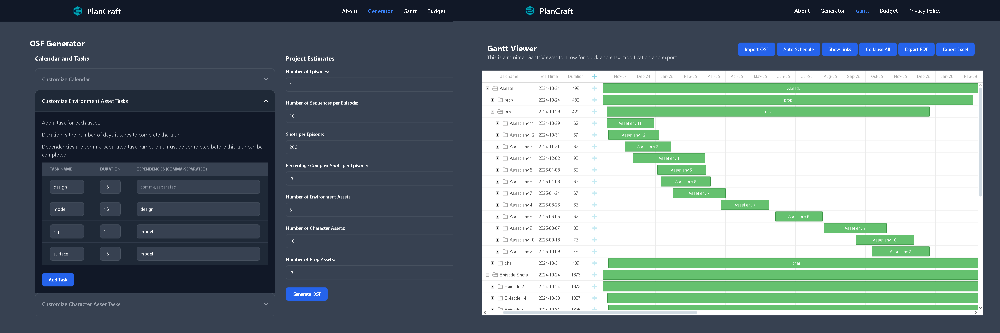

    

<h1 align="center">PlanCraft</h1>

    
    
    

**PlanCraft** is a simple and intuitive tool that helps you generate Open Schedule Format (OSF) files for your projects. With PlanCraft, you can easily define your project assumptions, tasks, durations, dependencies, and calendar settings to create a comprehensive schedule in OSF format.

 

Open Schedule Format (OSF) is a simple schema for a JSON representation of a schedule data and information model. 
It is intended for use in interchanging or archiving a schedule model and is therefore a descriptive rather than a prescriptive format. 
<a href="https://help.autodesk.com/view/GENSCHD/ENU/?guid=gs-osf">Open Schedule Format Documentation</a>

Its part of Autodesk Flow Generative Scheduling application
Flow Generative Scheduling allows you to generate scenarios of a schedule that has been imported into Flow Generative Scheduling. 
This means that you first create a schedule elsewhere and do not 
create or edit a schedule directly in Flow Generative Scheduling. 
<a href="https://help.autodesk.com/view/GENSCHD/ENU/?guid=gs-intro">Autodesk Flow Generative Scheduling Documentation</a>

## Features

*   **User-friendly interface:** PlanCraft provides a visual and easy-to-use interface for defining your project assumptions.
*   **Task templating:** Add, edit, and remove tasks for both assets and shots and define duration and dependencies.
*   **Duration and dependencies:** Specify task durations and dependencies to create a realistic project timeline.
*   **Resource allocation:** Automatically assign resources to tasks based on their names.
*   **Calendar settings:** Customize your work calendar to match your project's needs.
*   **OSF generation:** Generate a downloadable OSF JSON file that can be used in scheduling tools.
* **Gantt Viewer:** Import OSF files, preview, modify and export PDF or Excel files of your schedule.

## How to use

1.  **Input project details:**  Enter the number of episodes, shots per episode, and number of assets.
2.  **Define tasks:**  Add tasks for assets and shots, specifying their names, durations, and dependencies.
3.  **Customize calendar (optional):**  Adjust the default calendar settings if needed.
4.  **Generate OSF:**  Click the "Generate OSF" button to create and download your OSF JSON file.
5. **Import:** Import the OSF file into Flow Generative Scheduling to create escenarios and play with the schedule
6. **Schedule Escenarios:** Play with different scenarios generated by Flow Generative Scheduling
7. **Export OSF:** Export the scheduled escenario as OSF from Flow Generative Scheduling
8. **Import in Gantt Viewer:** Import and preview your schedule in the Gantt Viewer, where you can also manually modify Tasks
9. **Export PDF or Excel:** Export your schedule as a downloadable PDF or Excel file.

## License
* This project is licensed under the GPL-3.0 license - see the [LICENSE](LICENSE) file for details.
* This project also uses the DHTMLX Gantt and DHTMLX Suite, which are licensed under the GNU General Public License version 2.0 (GPLv2).
* You can find the full text of the DHTMLX Gantt GPLv2 license here: [license.txt](https://github.com/DHTMLX/gantt/blob/master/license.txt)
* You can find the full text of the DHTMLX Suite GPLv2 license here: [license.txt](https://github.com/DHTMLX/dhtmlx-suite-gpl/blob/master/license.txt)